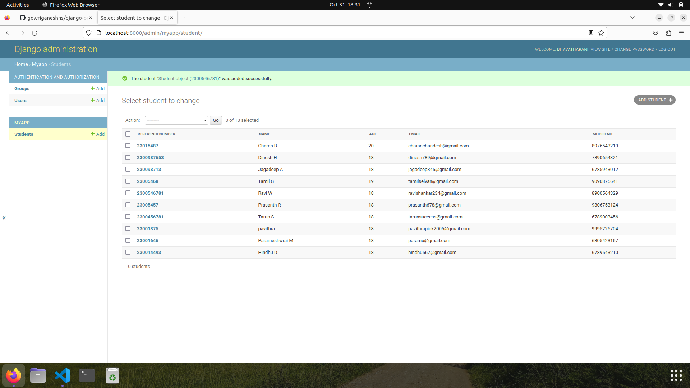

# Django ORM Web Application

## AIM
To develop a Django application to store and retrieve data from a database using Object Relational Mapping(ORM).
## DESIGN STEPS

### STEP 1:
Clone the problem from the GitHub
### STEP 2:
Create a new app in Django project
### STEP 3:
Enter the code for admin.py and models.py
### STEP 4:
Execute Django admin and create 10 student's details

## PROGRAM
```
from django.db import models
from django.contrib import admin
class Student (models.Model):
    referencenumber=models.CharField(primary_key=True,max_length=20,help_text="reference number")
    name=models.CharField(max_length=100)
    age=models.IntegerField()
    email=models.EmailField()
    mobileno=models.IntegerField()

class StudentAdmin(admin.ModelAdmin):
    list_display=('referencenumber','name','age','email','mobileno')
        
from django.contrib import admin
from .models import Student, StudentAdmin
admin.site.register(Student,StudentAdmin)
```
## OUTPUT

## RESULT
Thus the program for creating a database using ORM has been executed successfully

